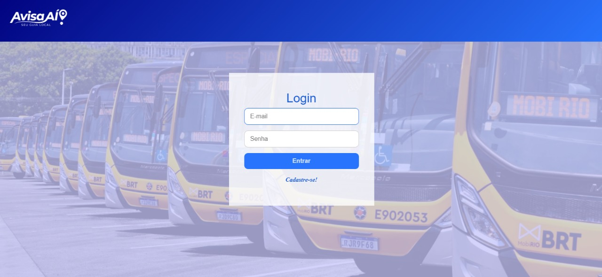
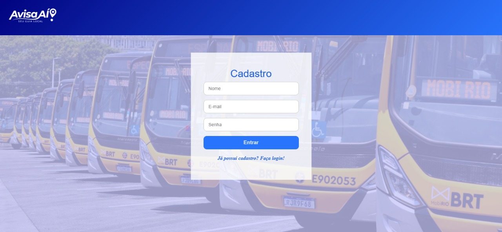

🗺️ Avisa Aí | Frontend (ReactJS & Styled-Components)
Este projeto é a interface do usuário (UI) da aplicação "Avisa Aí!", desenvolvida em ReactJS. Ele permite que o usuário agende notificações de chegada de ônibus e visualize a localização dos veículos em tempo real em um mapa interativo (Leaflet).

Visão Geral do Projeto
O objetivo principal é oferecer uma experiência fluida para agendar avisos e monitorar as linhas de ônibus.

🖼️ Telas da Aplicação
Veja como as principais telas se apresentam:

🚀 Como Executar o Projeto
Certifique-se de que o Backend esteja rodando antes de iniciar o Frontend, pois a aplicação depende da API para funcionar.

1. Pré-requisitos
Certifique-se de que você tem o Node.js (versão LTS recomendada) e o npm ou yarn instalados na sua máquina.

2. Instalação
Navegue até a pasta do projeto e instale as dependências.

➡️ Navegue para a pasta frontend
cd <desafio-tecnico-maravi>/frontend

➡️ Instale as dependências
npm install
# ou yarn install

3. Executando o Servidor
Para iniciar o servidor de desenvolvimento, execute o comando abaixo.

npm start
# ou yarn start

O projeto será aberto automaticamente no seu navegador padrão em: http://localhost:3000